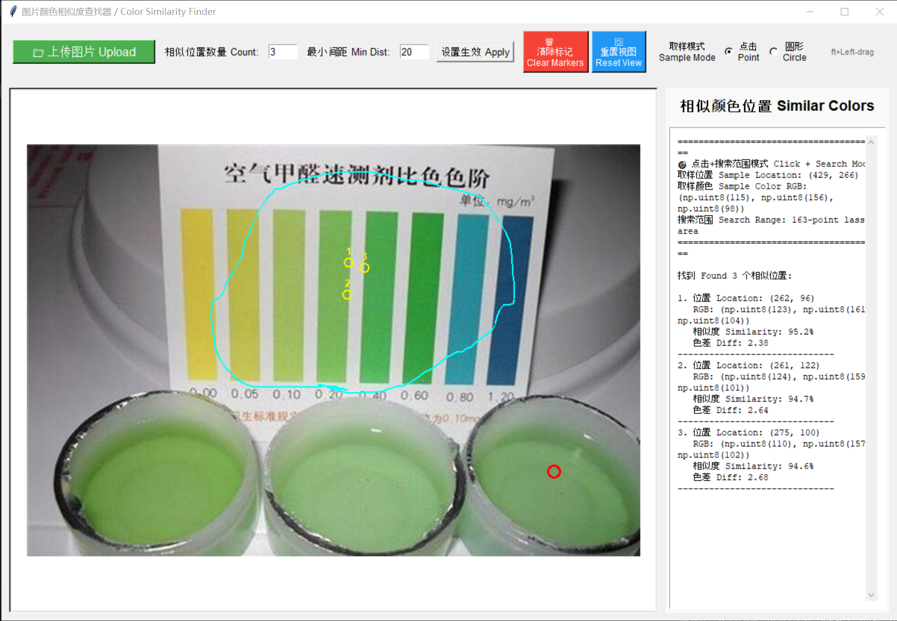

# Color Match / 颜色比对器

Match similar colors in a image. 颜色比对器（查找相似颜色，比如甲醛比色等等，结果仅供参考和娱乐）。

## Screenshot / 界面截图



## Installation / 安装

```bash
pip install -r requirements.txt
```

## Running the Application / 运行应用
```bash
cd color-match/
python color_match_app.py
```
## Usage / 使用方法

### Basic Workflow / 基本操作流程

1. **Upload Image / 上传图片**
   - Click "📁 上传图片" button / 点击"📁 上传图片"按钮

2. **Select Sampling Point / 选择采样区域**

3. **Define Search Area (Optional) / 定义搜索区域（可选）**
   - Hold **Shift + Left-click and drag** to draw a lasso / 按住**Shift+左键拖拽**绘制套索
   - Cyan line marks the search area boundary / 青色线条标记搜索区域边界
   - Similar colors will ONLY be found within this area / 仅在此区域内查找相似颜色

4. **View Results / 查看结果**
   - Program automatically finds similar colors / 程序自动查找相似颜色
   - Numbered circles mark similar locations / 带编号的圆圈标记相似位置
   - Right panel shows detailed information / 右侧面板显示详细信息

### Operations / 常用操作

- **Mouse Wheel** - Zoom in/out (centered on cursor) / 鼠标滚轮 - 缩放（以鼠标为中心）
- **Ctrl + Left-drag** - Pan/move the image / Ctrl+左键拖拽 - 平移图
- **🗑️ Clear Markers** - Clear all marks / 清除所有标记
- **🔄 Reset View** - Reset zoom and pan / 重置缩放和平移
- **Sample Mode** / 取样模式
  - **Point** - Click to sample single pixel color / 点击取样单点像素颜色
  - **Circle** - Drag to sample average color within circular area / 拖拽取样圆形区域平均颜色
